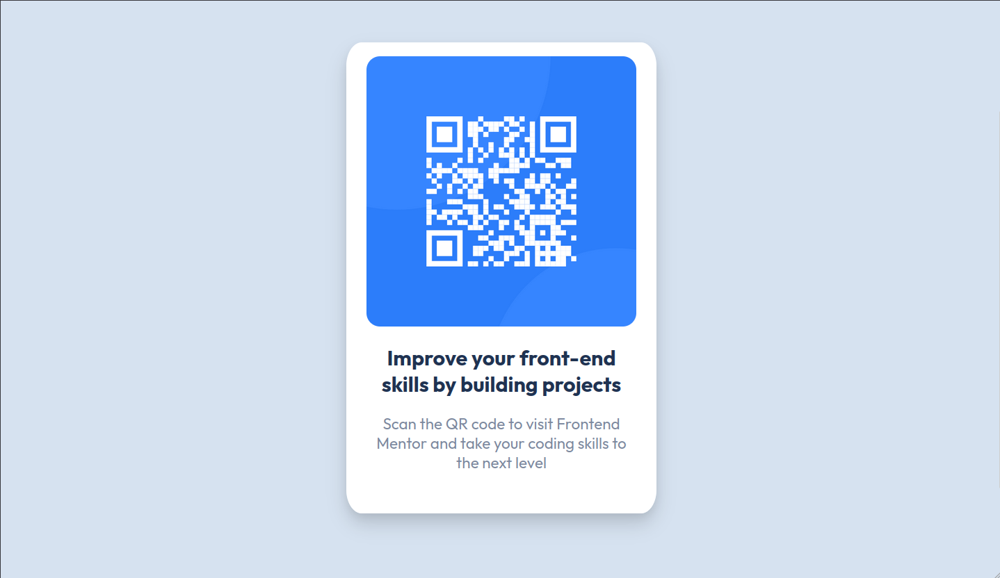

# Frontend Mentor - QR code component

First challenge for frontendmentor.io, I needed more HTML, CSS and responsive design practice while continuing to learn JS. This website was a great place to do it!

## Screenshot

## My process:

- Desktop first Workflow
- Responsive Design
- Flexbox

## Helpful resources:

[Box Shadow Generator CSS](https://html-css-js.com/css/generator/box-shadow/) - Helped me generate shadows

[live Site](https://d97d2ae6.qr-code-component-9tz.pages.dev/)
